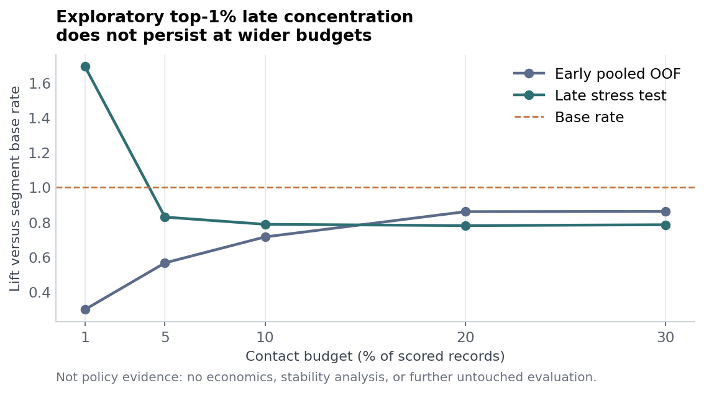
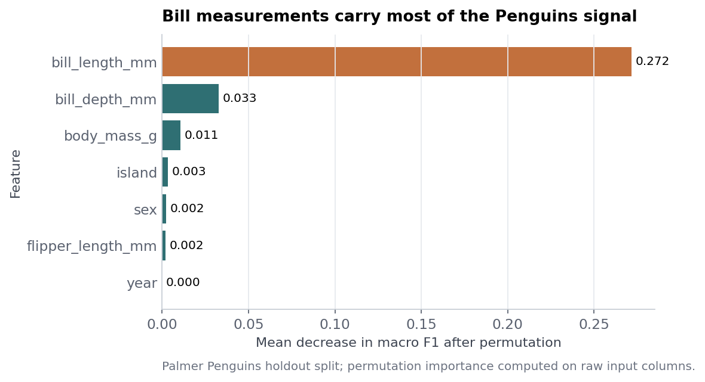

# Machine Learning Notebook Portfolio

[](https://github.com/MahmmodAbuhani/applied-ml-notebooks/actions/workflows/ci.yml)

Classical machine-learning portfolio focused on reviewable applied ML: public data, explicit leakage boundaries, fold-safe preprocessing, reproducible checks, readable model cards, and honest limitations.

I built this portfolio to show how I approach small classical machine-learning questions when validation risk matters as much as the score. The Bank Marketing case asks whether pre-call information can rank likely term-deposit responders without using post-call leakage. The Penguins companion traces one input through a transparent classifier, probabilities, training context, and model-internal contributions. Reviewers can inspect source notebooks, reusable Python helpers, model cards, figures, tests, and pinned public-data provenance. The work is educational and reproducible, not a deployed targeting system or biological field tool.

This is not production ML infrastructure, deep-learning research, or a deployed decision system. The repo is built to show applied ML reasoning in notebooks without hiding validation risk.

## 90-Second Review

1. Start with the [Bank Marketing case study](reports/bank_marketing_case_study.md) and [model card](reports/bank_marketing_response_model_card.md).
2. Try the [hosted Penguins demo](https://ml-notebooks-portfolio-public.streamlit.app/) or inspect the [browser explorer source](site/index.html).
3. Check the [reproduction guide](docs/REPRODUCING.md) and [verification tests](tests/).
4. Review [data sources and rights](docs/DATA_SOURCES.md), then finish with the scope and limitations below.

## Recruiter Read

- **Flagship:** Bank Marketing response modeling with a leakage-aware, source-order validation design.
- **Interactive companion:** [hosted Palmer Penguins Streamlit demo](https://ml-notebooks-portfolio-public.streamlit.app/) plus a browser-native static explorer with transparent inputs, probabilities, training context, and model-internal contributions.
- **Foundations:** five compact notebooks covering classification, regression, clustering, and model interpretation.
- **Review evidence:** unit tests, CI, stripped source notebooks, reusable helper modules, model cards, cross-runtime browser parity fixtures, an externally linked Bank execution snapshot, and temporary all-notebook workflow artifacts.

## Flagship: Bank Marketing

[`notebooks/bank_marketing_response_model.ipynb`](notebooks/bank_marketing_response_model.ipynb) is the main case study. It uses the UCI Bank Marketing dataset to ask whether a bank can rank prospective contacts before a call using only information available before that call.

The notebook excludes `duration`, which records call length and is only known after contact. It freezes the earliest 75% of source-order rows as the development segment, selects the model recipe only inside that early segment with four expanding-window folds, refits on all early rows, and scores the latest 25% once. Because the public CSV has row order but no complete row-level timestamp, this is an order-based temporal stress test, not a formal timestamped deployment validation.

The result is a validation finding, not a targeting win: pooled early and late ranking are weak, and the 10% contact budget has `0.79x` lift.

| Evidence | Result | Read |
| --- | ---: | --- |
| Selected recipe | Class-weighted random forest, `min_samples_leaf=50`, `max_features=0.5` | Chosen by the predeclared mean-fold AP rule; not evidence of meaningful superiority |
| Early mean-fold AP and lift | AP `0.108`; AP lift `1.09x` | Unstable across folds: AP `0.046` to `0.266`, prevalence `0.055` to `0.176` |
| Early pooled OOF ranking | AP `0.078`; ROC AUC `0.470` | Below pooled base prevalence `0.087` |
| Late stress AP | `0.238` | Below the late base response rate of `0.258` |
| Late stress ROC AUC | `0.457` | Weak ranking transfer under source order |
| Late top 1% lift | `1.69x` | Exploratory top-1% concentration, not policy evidence |
| Late top 10% lift | `0.79x` | Not strong enough for a broad contact policy |
| Leakage diagnostic | AP `0.084` without `duration`; AP `0.427` with `duration` | Post-call leakage would make the notebook look much better than it is |



Read the short written case study at [`reports/bank_marketing_case_study.md`](reports/bank_marketing_case_study.md) and the model card at [`reports/bank_marketing_response_model_card.md`](reports/bank_marketing_response_model_card.md). For executed output, download or open the versioned [`Bank HTML snapshot`](reports/evidence/bank_marketing_executed.html) locally and inspect its [`provenance manifest`](reports/evidence/bank_marketing_provenance.json). The snapshot records its source commit, source-notebook hash, pinned UCI input checksum, environment, HTML hash, and external figure hashes. It is historical review evidence, not a live report.

## Interactive Companion: Penguins

[`notebooks/palmer_penguins_end_to_end.ipynb`](notebooks/palmer_penguins_end_to_end.ipynb) is the compact end-to-end workflow. It loads a pinned public Palmer Penguins CSV, verifies schema and checksum, keeps preprocessing inside pipelines, compares models, evaluates a holdout set, reviews errors, and explains feature contributions carefully.

The companion demos are educational. The [hosted Streamlit app](https://ml-notebooks-portfolio-public.streamlit.app/) accepts plausible penguin morphology and collection-context inputs, predicts species probabilities, shows where the input sits relative to training data, and states the model boundary. The [browser-native explorer source](site/index.html) reproduces a versioned logistic model locally with no backend. Both surfaces expose model-internal contributions without presenting them as biological causes.

```bash
python3.12 -m venv .venv
source .venv/bin/activate
python -m pip install --upgrade pip
python -m pip install -r requirements.txt -c constraints-py312.txt
streamlit run streamlit_app.py
```

CLI version:

```bash
python demo/predict_penguin_species.py
```

Penguins holdout result: logistic regression, accuracy `0.988`, balanced accuracy `0.991`, macro F1 `0.986`. A repeated 5-fold, 3-repeat training-only check reports macro F1 `0.992 ± 0.012`; the untouched holdout remains the primary result.



## Educational Foundations

These notebooks are intentionally secondary. They show that the core validation habits transfer across standard scikit-learn tasks.

| Notebook | Dataset | What it demonstrates | Result |
| --- | --- | --- | --- |
| [`decision_tree_classifier.ipynb`](notebooks/decision_tree_classifier.ipynb) | Breast Cancer Wisconsin | Train-only tree and forest selection, interpretation | Random forest balanced accuracy `0.943` |
| [`knn_classification_project.ipynb`](notebooks/knn_classification_project.ipynb) | Handwritten digits | Fold-safe scaling, k tuning, error review | `k=5`, macro F1 `0.964` |
| [`kmeans_clustering.ipynb`](notebooks/kmeans_clustering.ipynb) | Wine chemistry | Unsupervised k selection, PCA, post-hoc label benchmarking | `k=3`, silhouette `0.285`, ARI `0.897` |
| [`regression_modeling_project.ipynb`](notebooks/regression_modeling_project.ipynb) | Diabetes regression | Validation-based model choice and residual review | Ridge RMSE `53.63`, R² `0.457` |
| [`random_forest_tree_models.ipynb`](notebooks/random_forest_tree_models.ipynb) | Iris | Tree paths, forests, educational stacking | Random forest macro F1 `0.949` |

The KMeans and Ridge figures are backed by the compact [foundations metrics snapshot](reports/foundations_metrics.json), rebuilt from the two source notebooks.

## Repository Map

```text
applied-ml-notebooks/
├── .github/workflows/      # fast CI plus scheduled/manual notebook execution
├── assets/figures/         # small generated preview figures
├── demo/                   # Penguins CLI and Streamlit app guide
├── docs/                   # data sources and reproduction guidance
├── notebooks/              # stripped source notebooks
├── reports/                # model cards, case studies, and Bank execution evidence
├── scripts/                # Evidence builders, browser export, and verification commands
├── site/                   # Static browser explorer and versioned model artifact
├── src/ml_portfolio/       # reusable data, evaluation, ranking, plotting helpers
├── tests/                  # focused unit tests for reusable code
├── streamlit_app.py        # root entry point for the hosted/local Penguins demo
├── SECURITY.md             # private vulnerability reporting guidance
├── constraints-py312.txt   # transitive constraints for Python 3.12
├── requirements-dev.txt
└── requirements.txt
```

## Verification

Fast CI checks package import, unit tests, a network-free CLI smoke test, notebook JSON validity, stripped notebook source policy, the committed Bank evidence hashes and figure assets, and pre-commit hooks. The versioned Bank HTML is a durable snapshot tied to its source commit, input checksum, and external figure assets. Separately, the Notebook Execution workflow runs on a schedule or manually, downloads public data, executes all notebooks, and uploads temporary executed notebook and HTML artifacts with 30-day retention. Those temporary artifacts are broader execution checks, not a permanent report surface.

Run the local checks:

```bash
python -m pip install -r requirements-dev.txt -c constraints-py312.txt
python -m unittest discover -s tests -v
python demo/predict_penguin_species.py
python scripts/verify_bank_evidence.py
python scripts/verify_penguins_browser_model.py --offline
node --test tests/browser/model-parity.test.mjs tests/browser/reflow-contract.test.mjs
pre-commit run --all-files
```

Validate stripped notebooks:

```bash
python - <<'PY'
from pathlib import Path
import nbformat

for path in sorted(Path("notebooks").glob("*.ipynb")):
    notebook = nbformat.read(path, as_version=4)
    nbformat.validate(notebook)
    for index, cell in enumerate(notebook.cells, start=1):
        if cell.cell_type == "code":
            assert cell.execution_count is None, f"{path}: cell {index} has execution count"
            assert not cell.outputs, f"{path}: cell {index} has outputs"
    print(f"{path}: valid and stripped")
PY
```

Execute notebooks into a temporary directory:

```bash
mkdir -p /tmp/ml-notebook-checks
jupyter nbconvert \
  --to notebook \
  --execute notebooks/*.ipynb \
  --output-dir /tmp/ml-notebook-checks \
  --ExecutePreprocessor.kernel_name=python3 \
  --ExecutePreprocessor.timeout=900
```

## Scope

- Classical ML notebooks only.
- Public datasets only.
- Source notebooks stay stripped for clean review.
- Bank Marketing is an analysis case study, not a customer-targeting product.
- Penguins is an educational demo, not a wildlife field tool or production service.
- The hosted Streamlit demo is verified at [ml-notebooks-portfolio-public.streamlit.app](https://ml-notebooks-portfolio-public.streamlit.app/); the browser explorer remains a static, browser-local artifact.
- No business impact, contact economics, production deployment status, or external usage is claimed.

## License

MIT License. See [`LICENSE`](LICENSE).
